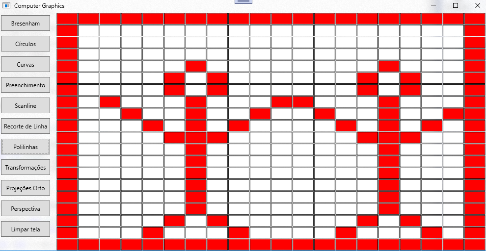

# CG Basic Algorithms
A simple GUI made with [WPF](https://github.com/sourcechord/FluentWPF) to demonstrate the functionality of some basic algorithms presented 
at CG classes.

## Algorithms
* Line
* Circle
* Fill
* Scanline
* Trim
* Polyline
* Transformations
* Orthogonal Projection
* Perspective

## Install
*NuGet Package*
```
Install-Package FluentWPF
```
https://nuget.org/packages/FluentWPF

## Interface

